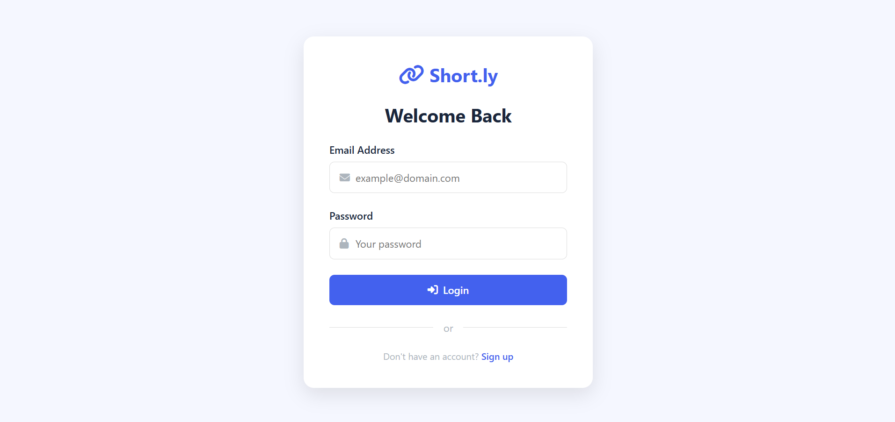
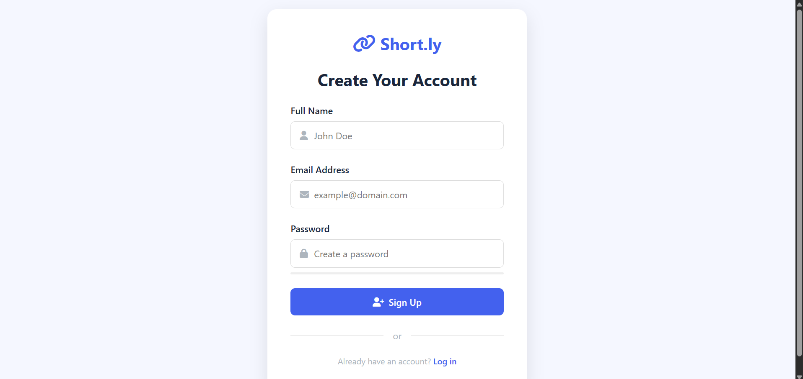
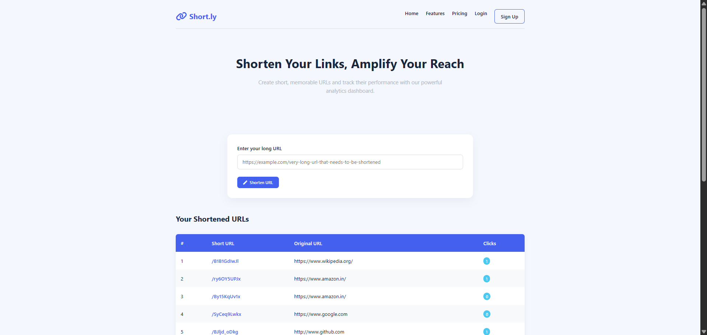
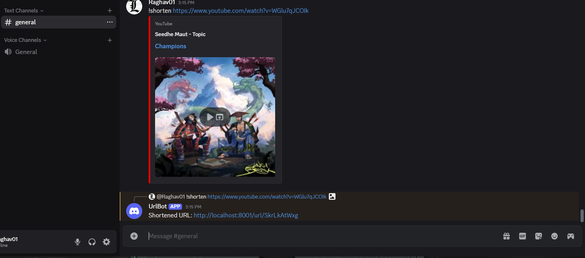

# 🔗 Short URL Service with User Authentication

A Node.js application that allows users to shorten URLs with user login/register functionality. Built using Express.js, MongoDB, EJS, and JWT.

## 🚀 Features
- User registration and login (JWT based)
- Shorten long URLs to custom short links
- Middleware-protected routes
- EJS templating with responsive UI
- MongoDB with Mongoose
- Secure with Bcrypt and Helmet

## 🗂️ Project Structure
```bash
.
├── controllers/
│   ├── url.js
│   └── user.js
├── middlewares/
│   └── auth.js
├── models/
│   ├── url.js
│   └── user.js
├── public/
│   ├── css/
│   └── images/
│       ├── Admin_Dashboard.png
│       ├── DiscordBot.png
│       ├── Login.png
│       └── Register.png
├── routes/
│   ├── staticRouter.js
│   ├── url.js
│   └── user.js
├── views/
│   ├── home.ejs
│   ├── login.ejs
│   └── signup.ejs
├── .env.example
├── index.js
└── package.json

```

## 📸 Screenshots
| Login Page | Register Page |
|------------|---------------|
|  |  |
| Admin Dashboard | Discord Bot |
|  |  |

⚙️ Setup & Usage

# Clone and setup (run these commands)
git clone https://github.com/0Raghav-Sharma0/short-url-nodejs.git
cd short-url-nodejs
npm install
cp .env.example .env
nano .env  # Add your credentials
npm start

Access at: http://localhost:3000

🔑 Environment (.env)
```bash 
PORT=3000
MONGO_URI=mongodb://localhost:27017/short-url
JWT_SECRET=your_strong_jwt_secret_here
# Optional:
EMAIL_USER=your@email.com
EMAIL_PASS=your_email_password
```
---

🌐 API Endpoints
```bash
Method    Endpoint         Description
POST      /api/signup      Register new user
POST      /api/login       Login to get JWT token
POST      /api/shorten     Create short URL
GET       /:shortId        Redirect to original URL
```

👨‍💻 Author

Raghav Sharma  
📚 IIIT Sonepat (2023–2027)  
🔗 GitHub: https://github.com/0Raghav-Sharma0  
💻 LeetCode: https://leetcode.com/u/RaghavSharma01/

📜 License

This project is licensed under the MIT License - see the [LICENSE](./LICENSE) file for details.


